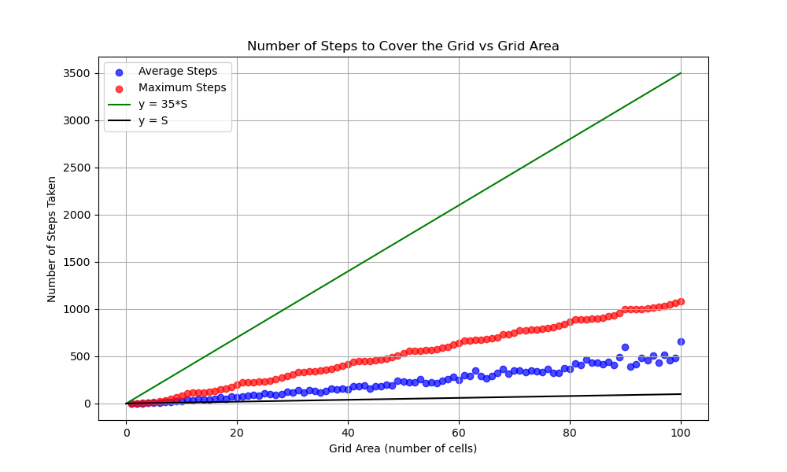
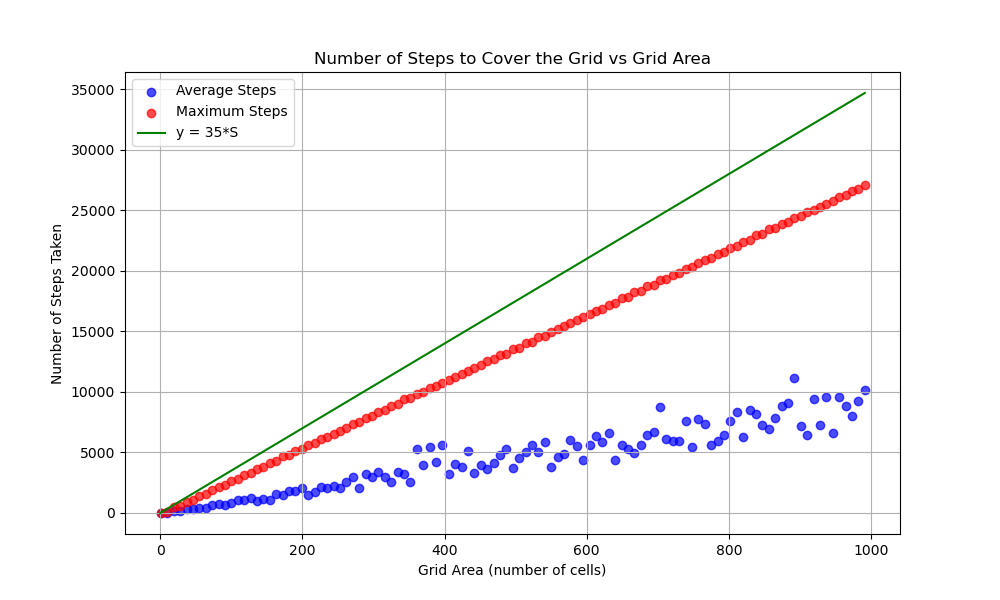
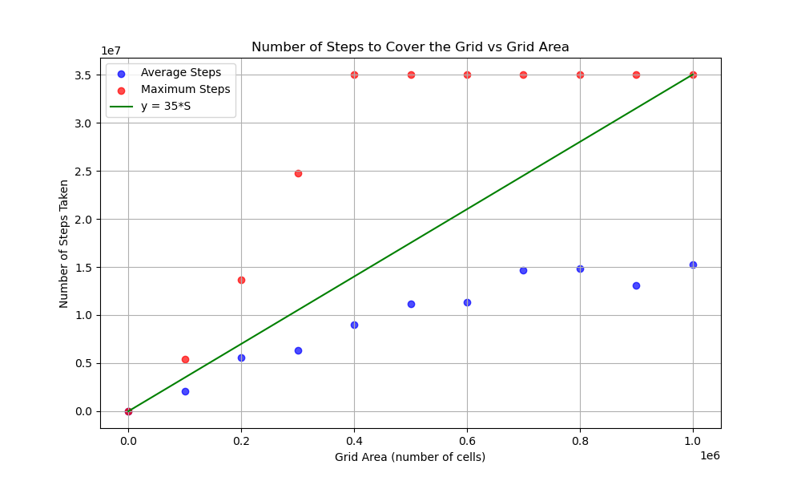
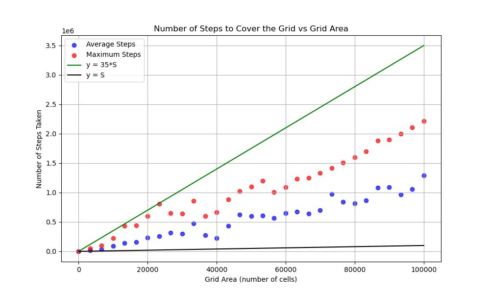

# Playing Snake with your eyes closed

## Introduction

I observed that the problem can be reduced to visiting each cell of the grid. If we visit them all, we know we won the game. The metric for performance I will use is how many moves it took to visit all the cells.

I created a Python script that generates the commands in the required format and writes them to a file. Then, another script runs a series of experiments: It takes a few areas in a defined interval, and for each area, it generates a few grids (square, 1xS, Sx1, and a few rectangles). It then runs the commands in the file over these grids to see how many steps it takes until every cell in the grid has been visited. For each area, the average and maximum number of moves are kept and plotted.

## Approaches

1. **Spiral Traversal**
   - **Idea**: The naive approach was to traverse the grid in a spiral pattern.
   - **Implementation**: Move 1 right, 1 down, 2 left, 2 up and so on.
   - **Limitation**: For grids of sizes Sx1 or 1xS, this resulted in an **O(S²)** complexity, making it inefficient for long, narrow grids.

2. **Fixed Prime Steps**
   - **Idea**: Move right by a fixed prime number of steps and then move down one step. Cycle through a number of small primes and repeat this algorithm until all cells are visited or the move limit is reached.
   - **Implementation**: Define a static list of small primes. For each prime `p` in the list, execute `p` right moves followed by one down move.
   - **Limitation**: This approach works very well on only small surfaces with fewer primes or on very large surfaces with many primes, but it does not perform optimally across both ends of the spectrum. For example, with a list of primes that works like this on small surfaces:
  \
  \
   would work like this on large ones:\
\

3. **Dynamic Prime Range**
   - **Idea**: Use a dynamic range of primes to adapt to different grid sizes. Implement a function that receives the index of the current command and returns the first and last indices of the primes to be used from the prime pool.
   - **Implementation**: The function determines the subset of primes to use based on the current command index `i`. This allows the algorithm to adjust the range of primes dynamically, providing flexibility and better performance across a wide range of grid sizes.
   - **Outcome**: This approach works well in most cases, significantly improving performance and ensuring efficiency across both small and large grids. However, there are a few exceptions where the move limit is slightly exceeded, indicating areas for further optimization. While I haven't managed to make it work perfectly, I believe it can be done
  
Some of the best results I managed to achieve with this:

  

## Logic Behind the Dynamic Prime Approach

- **Co-Prime Steps**: Using prime numbers for movement steps increases the likelihood that the step size is co-prime with the grid dimensions. This minimizes the number of times the snake revisits the same cell.
  
- **Coverage Efficiency**: Co-prime step sizes ensure that the traversal pattern covers the grid more uniformly, reducing overlaps and repeated visits to the same cells.

- **Adaptive Step Sizes**: By dynamically adjusting the range of primes based on the current command index, the algorithm can use smaller steps on smaller grids and larger steps on larger grids. This adaptability ensures that the number of moves remains efficient across various grid sizes.

## Improvement idea

We can use techniques from ML to achieve the best possible primes selecting function. We parametrize it (for example, a 5th degree polynomial, with 6 degrees of freedom) and use an optimizer (like Adam or Stochastic Gradient Descent) to find the best combination of these parameters. We also would define a cost function, that increases with the number of maximum steps for a specific area.

## Conclusion

The dynamic prime step algorithm provides an effective solution for traversing grids of unknown dimensions efficiently. By adaptively selecting the range of primes used for movement, the algorithm balances the need for coverage and move efficiency across a wide variety of grid sizes and shapes.

Further improvements can be made by fine-tuning the parameters in the prime index selection function and exploring additional strategies for dynamic adjustment based on real-time feedback during traversal.

## Appendix: Key Concepts

### Usage
* `python3 path.py` - generates `35M` commands and write them to `commands.txt`
* `python3 run_tests.py` - runs the tests and generates the plot and saves it to `plot.png`

